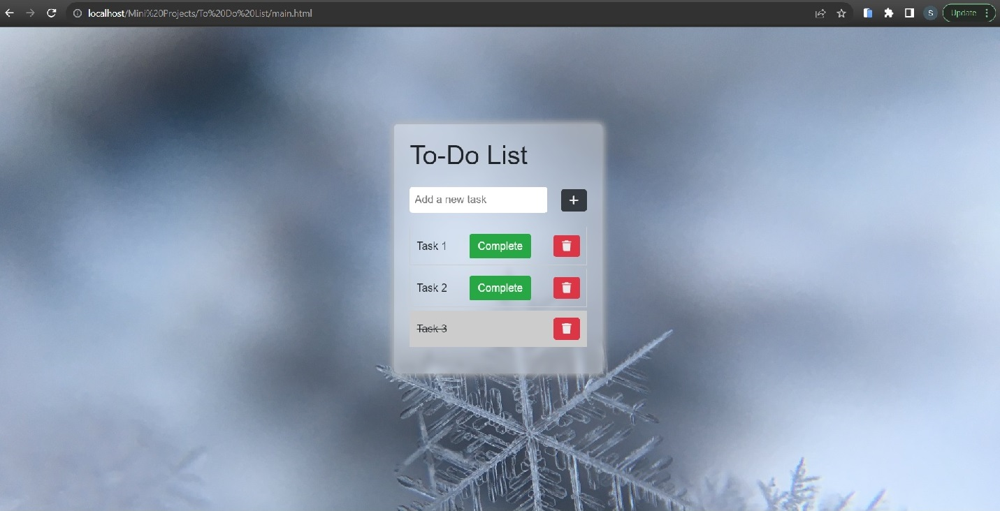

# To-Do-List

Uses basic HTML, CSS and JavaScript to create a To-Do List.

Features-
  1. Add new tasks.
  2. Mark tasks complete.
  3. Delete tasks.
  4. Expandable code.

Future-
  1. Allow users to create accounts.
  2. Save ttheir To-Do List.
  3. Send user reminders.

#HTML5 #CSS3 #JavaScript #VanillaJS
